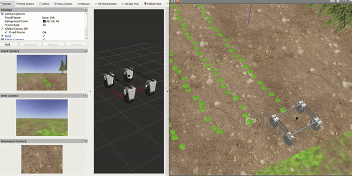
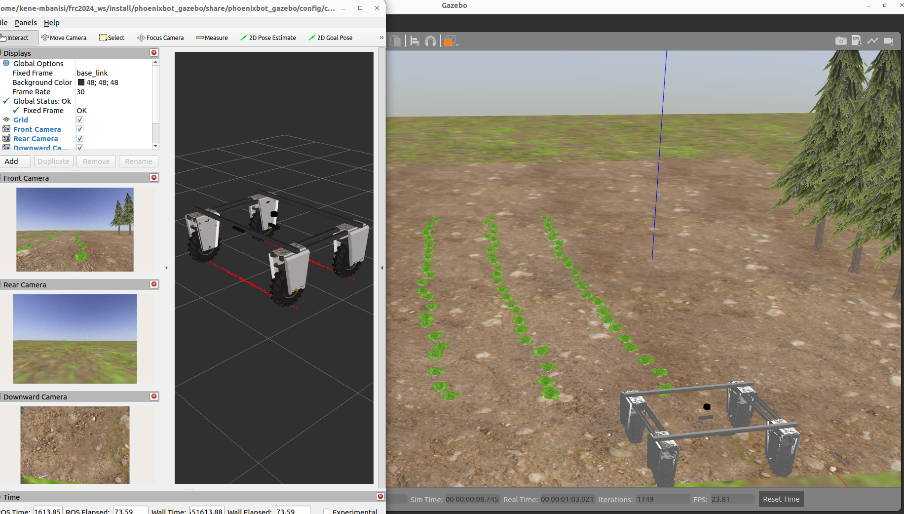
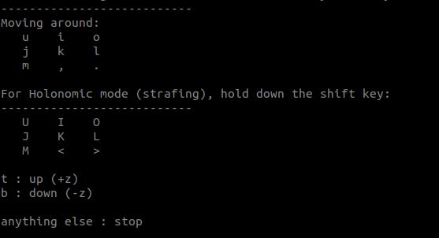

# Phoenixbot (Olin College's Sustainable Agricultural Robot Platform)

The Phoenixbot is [Olin College's](https://www.olin.edu/) first sustainable agricultural robot platform, developed my students and faculty. The robot platform is addressing the need for sustainable, ecological weed management strategies for healthier and more sustainable agriculture. It is designed on the [farm-ng Amiga micro tractor platform](https://farm-ng.com/products/la-maquina-amiga).



<br>

## Repository Summary

- [```phoenixbot_description```](https://github.com/Olin-HAIR-Lab/phoenixbot/tree/main/phoenixbot_description): contains the URDF description files for the phoenixbot, sensors, etc.

- [```phoenixbot_gazebo```](https://github.com/Olin-HAIR-Lab/phoenixbot/tree/main/phoenixbot_gazebo): contains model, world, launch and configuration files to simulate the phoenixbot in Gazebo.

<br>

## Installation

### Install Locally

This system was tested on Ubuntu 22.04 LTS and ROS2 Humble.

#### 1. Create your ROS2 workspace and clone the repository

```bash
mkdir -p ~/ros2_ws/src
cd ~/ros2_ws/src
git clone https://github.com/Olin-HAIR-Lab/phoenixbot.git 
```

#### 2. Install all the relevant ROS dependencies

```bash
cd ~/ros2_ws
sudo rosdep init
rosdep update
rosdep install --from-paths src --ignore-src --rosdistro humble -r -y
```

#### 3. Source the ROS installation and workspace overlay (do only once)

```bash
echo "source /opt/ros/humble/setup.bash" >> ~/.bashrc
echo "source ~/ros2_ws/install/setup.bash" >> ~/.bashrc

source ~/.bashrc
```

#### 3. Build the package(s)

```bash
# navigate to the root of the workspace and build the packages
cd ~/ros2_ws
colcon build --symlink-install
```

### ROS Development Container

Provides an easy setup of ROS with the Dev Container extension of VS Code.
The setup was originally created using the [VS Code Docker Guide](https://docs.ros.org/en/humble/How-To-Guides/Setup-ROS-2-with-VSCode-and-Docker-Container.html) in the ROS 2 documentation, but has been modified by [Eruvae](https://github.com/Eruvae/ROS-devcontainer) and again for our specific use-case.

#### Prerequisites

You have to install VS Code, Docker, and the Dev Container extension for VS Code.
The installation of VS Code on Ubuntu is described [here](https://code.visualstudio.com/docs/setup/linux).
For a guide to set up dev containers, check out [this tutorial](https://code.visualstudio.com/docs/devcontainers/tutorial).
For installing docker on Ubuntu, you can use the docker apt repository, as described in the [docker docs](https://docs.docker.com/engine/install/ubuntu/).
The official docker packages of Ubuntu may also work, but may be older versions.

#### NVIDIA GPU acceleration

To enable GPU acceleration in the containers, make sure you also install the [NVIDIA Container Toolkit](https://docs.nvidia.com/datacenter/cloud-native/container-toolkit/latest/install-guide.html). Note: If you already have the CUDA apt repository set up, it includes the nvidia-container-toolkit package, so you don't need to add the nvidia-container apt repository. Run:

```bash
sudo apt-get install -y nvidia-container-toolkit
sudo nvidia-ctk runtime configure --runtime=docker
sudo systemctl restart docker
```

In devcontainer.json, make sure "--gpus", "all" is added to runArgs (this is already the case for the workspaces in this repository), or configure it to use a specific device.

#### Workspace setup

The phoenixbot repo contains a hidden .devcontainer folder with the configuration files for the container.
To start up the container, you can press F1 and search for "Dev Containers: Open Folder in Container...".
Alternatively, you can navigate to the folder in a terminal and open it with "code .".
VS Code should recognize the .devcontainer configuration and ask you if you want to reopen the folder in the container.
If it doesn't, you can also press F1 and search for "Dev Containers: Rebuild and Reopen in Container".
If you change your configuration while being inside of the container and need to rebuild it, select "Dev Containers: Rebuild Container".

You may want to modify the files for your setup:

#### PhoenixBot Packages & Dependencies

This devcontainer by default only includes the PhoenixBot repository. However, by uncommenting lines in the `"mounts"` section of [devcontainer.json](.devcontainer/devcontainer.json), you can include additional PhoenixBot packages for development.

When including additional packages in the devcontainer, it expects a specific file-structure on the host machine. Other packages, such as `phoenixbot_navigation` or `phoenixbot_weeding` should sit in the same parent folder as `phoenixbot`, as shown:

```
ros2_ws
`-- src
    |-- phoenixbot
    `-- phoenixbot_navigation
```

Once the devcontainer is created, workspace dependencies will be installed via rosdep and the included packages will be built with colcon.

<br>

## How to Run

### Start the Gazebo simulation

```bash
ros2 launch phoenixbot_gazebo gazebo_world.launch.py
```

NOTE: It may take a few minutes to come up the first time around, so please be patient.

If everything has been installed correctly, you should see Gazebo and Rviz windows open as below:



### Move the robot using keyboard teleoperation

```bash
# first, install the dependency
sudo apt install ros-humble-teleop-twist-keyboard

# run the command in a new terminal
ros2 run teleop_twist_keyboard teleop_twist_keyboard
```

Control the robot with the keyboard keys as below:


